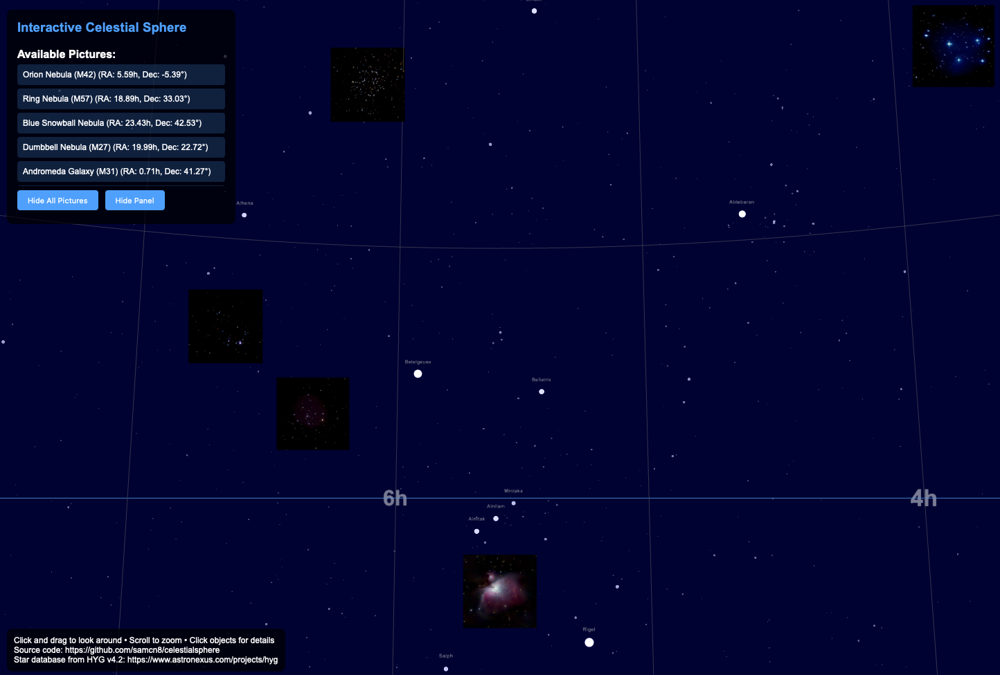

# Interactive Celestial Sphere

This is a "vibe coded", interactive, browser-based celestial sphere that I built for better visualizing my set of astrophotography images.  I used Claude Sonnet 4.5 to build this script.

## Overview

This is an interactive, browser-based celestial sphere built with Three.js.  It visualizes stars from the HYG v4.2 catalog and overlays a provided set of pictures onto the sphere.  Links and information about the pictures are provided in a `pictures.json` file.  This currently contains fully qualified URLs to my personal images, but you can replace this file with links to your own images, if desired.

It's both desktop and mobile friendly.  The user can click or tap objects for more information and use mouse/touch controls to look around and zoom.

You can see it in action here: https://samnelson.dev/celestialsphere.

You can run it locally like this:

```bash
python3 -m http.server 8000
# then open http://localhost:8000/index.html in your browser
```

The following is a screenshot of the web GUI:



## Acknowledgments

The following were used in the making of this script:
 * Vibe coded with Claude Sonnet 4.5
 * Three.js (r128): https://threejs.org/
 * HYG star database (v4.2): https://www.astronexus.com/projects/hyg, which is licensed under [CC BY-SA 4.0](https://creativecommons.org/licenses/by-sa/4.0/deed.en).  Note I removed stars greater than magnitude 6.6, which are too dim to display, as well as the Sun.